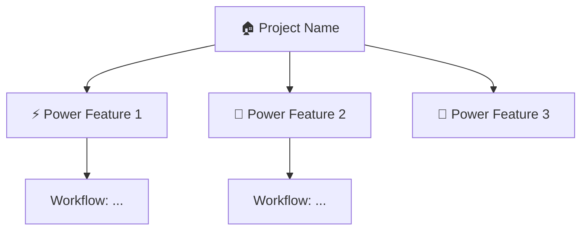

# Illuminator Output Format

The synthesis subagents (Phase 4) and the polish pass (Phase 5) produce content in this shape. Read this file in full before writing any constellation document.

## Entry Point: `.illuminator/README.md`

````markdown
# 🔭 [Project Name] -- Illuminate

> One-sentence: what this project IS and why you'd care.

## 🗺️ Capability Map



## 🚀 Top Leverage Plays

1. **[Play Name]** -- What + why it's powerful → [details](./workflows/play-name.md)
2. ...

## 📚 Go Deeper

- [Core Concepts](./concepts/) -- What you need to understand
- [Workflows](./workflows/) -- Step-by-step power patterns
- [Leverage Map](./leverage-map.md) -- All capabilities ranked by impact
````

## Visual Language

| Emoji | Meaning              |
| ----- | -------------------- |
| 🔭    | Overview / discovery |
| ⚡    | Power features       |
| 🚀    | Workflows / actions  |
| 🎯    | Specific use cases   |
| 🔧    | Tools / utilities    |
| 📚    | Deeper reading       |
| 💡    | Insights / tips      |
| ⚠️    | Gotchas / warnings   |

Use **mermaid diagrams** for: capability maps (`graph TD`), workflow sequences (`sequenceDiagram`), decision trees, concept relationships (`graph LR`).

## Progressive Disclosure (every document)

1. **TL;DR** -- One paragraph, scannable in 10 seconds
2. **Visual** -- Mermaid diagram or emoji-annotated overview
3. **Practical example** -- "Here's how you'd actually use this"
4. **Details** -- For those who want depth
5. **Links** -- Related docs in the constellation

## Interlinking

Every document links to:

- Entry point (README.md) for navigation
- 2-4 related documents for lateral exploration
- Deeper documents for progressive disclosure

Use relative links: `[Feature X](./concepts/feature-x.md)`
